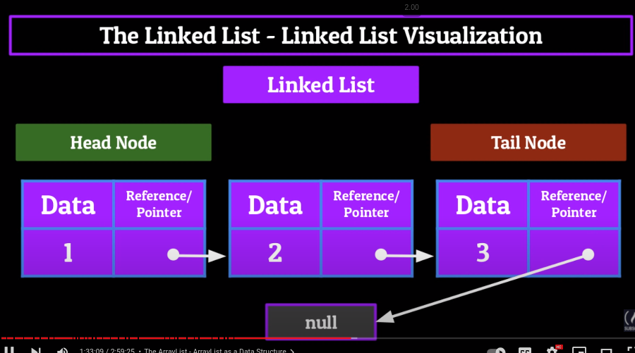
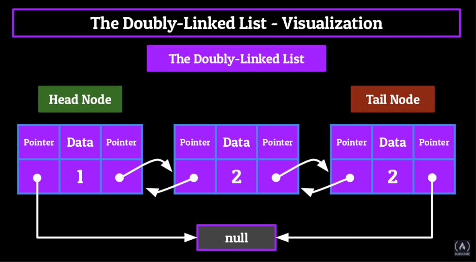

# Data structures

## **1. Array**:
- Array is a linear data structure used to store the elements with same data types and has a fixed size.

### **Time Complexity**

| Operation| Time complexity|
| ------------- | ------------- |
| Accessing | O(1) |
| Searching | O(n) |
| Inserting | O(n)|
| Deleting | O(n) |

 

## **2. ArrayList**:
- ArrayList can be thought as a growing array

### **Time complexity**

| Operation| Time complexity|
| ------------- | ------------- |
| Accessing | O(1) |
| Searching | O(n) |
| Inserting | O(n)|
| Deleting | O(n) |

### **Methods**
- add
- remove (based on index)
- remove (baaed on object)
- get
- se

 

## **3. Stack**:

 - Stack: A sequential access data structure in which we use the LIFO principle to add and remove elements
from.
LIFO
- We add elements to the back(tail) and remove them from the back(tail)
- Applications of stacks: Backpaging, undo-redo, recursion.
### **Time complexity**

| Operation| Time complexity|
| ------------- | ------------- |
| Accessing | O(n) |
| Searching | O(n) |
| Inserting | O(1)|
| Deleting | O(1) |

### **Methods**
- push(Object<Type>)
- pop
- peek
- contains

 

## **4. Queue**

- Queue: A sequential access data structure which follows the FIFO methodology.
- FIFO: First in First Out
- We add elements to the back(tail) and remove them from the front(head)
- Applications of queues: Job scheduling, printer queuing

### **Time complexity**

| Operation| Time complexity|
| ------------- | ------------- |
| Accessing | O(n) |
| Searching | O(n) |
| Inserting | O(1)|
| Deleting | O(1) |

### **Methods**
- enqueue (add elements to the back)
- deque (remove elements from front)
- peek (returns the forefront of our queue)
- contains (checks if the element is present in the stack and return true/false)

 

## **5. LinkedList**

- LinkedList: a linkedList ia a sequential access linear data structure in which every element is a separate
object called Node, which has 2 parts:
  1. **The data** (Integer, string, object)
  2. **The reference** (or pointer) which points to the next Node in the List.(These are actually locations in the memory)
- With normal linkedList we can only go forward with our pointer never backwards.(this problem is solved by doubly linked list).
- LinkedList will have head node and a tail node:
  1. **Head node:** If the head node does not have a next node, then the reference/pointer will be null. If it has a next node then it will points to the next node.
  2. **Tail node:** tail node is the end of the linkedList, its pointer will always points to null.
- Adding and removing elements from linkedList:
  - Data can flow in and out of any point of a linkedList.
  - Whenever we change a node in linkedList we also have to change its pointer. 
  - **Adding to the head of a linkedList:** make that new node's pointer point to the current head of the linkedList.
  - **Removing from the head of a linkedList:** set the head node pinter to a null value
  - **Adding a node to the middle of linkedList:** 
    - make the pointer of the new node point to the node after the location we want to insert at.
    -  Set the node before the location we want to insert at to point towards the new node.
  - **Removing node from the middle of a linkedList:**
    - make the pointer of the node previous to the one we're removing, to now point to the node after the one we're removing. 
  - **Adding a node to the tail:**
    - make the current tail point to the new node and make the new node's pointer point to null. 
  - **Removing from tail of a linkedList:** 
    - Set the previous tail to point towards a null value instead of the current tail.

 

  
- **LinkedList applications:**
  - LinkedList can be used in the backing of other Data structures.
  - we can use linkedList to make stacks, queues, etc.
  - Spotify(once the current song is done playing, the next song's album cover, metadata and audio file is loaded in player), image viewer where each node is an image.

### **Time complexity**

| Operation| Time complexity|
| ------------- | ------------- |
| Accessing | O(n) |
| Searching | O(n) |
| Inserting | O(n)/ O(1) |
| Deleting | O(n)/ O(1) |

## **6. Doubly LinkedList**

- LinkedList: a doubly linkedList ia a sequential access data structure which stores data in the form of node
  - able to traverse both forwards and backwards using pointers.
  - doubly linkedList have pointers to both previous node and next node.
  - **Adding to the head of doubly linkedList:**
    - Set  the new nodes next to point towards the current head of the list
    - Take the new node that we want to insert and set its previous to null
    - Set the current heads current points to this new node.
  - **Removing from the head of doubly linkedList:**
    - Set the head node's next to point towards the null
    - Set the second node's previous also point towards a null value
  - **Inserting into the middle of a doubly linkedList:**
    - Set the new node's previous to point towards to the position that you wanted to insert at.
    - Set the new node's next to point towards the node after the position you want to insert at.
    - Set the next and previous on the node's before and after the one you're inserting to point towards the new node.
  - **Removing from the middle of a doubly linkedList:**
    - Set the node before the one we want to remove's next to point towards the node after the one we want to remove
    - Set the node after the one we want to remove's previous towards the node before the one we want to remove
    - Set both pointers of the node we want to point towards a null value.
  - **Add to the tail of a doubly linkedList:**
    - Set the next pointer of the current tail to pointer towards the new node we want to become the tail
    - Set the previous pointer of the new node to the current tail of the list
    - Set the next pointer of new node point towards null
  - **Remove from the tail of doubly linkedList**
    - Set the tail node's previous point towards null.
    - Set the second to last node's next to also point towards null.
  - **DLL applications:**
    - The back and forth functionality fo doubly linkedList lends itself to be implemented in a lot of stack-like functionality.
    - Mostly used when we want to use list of objects with multiple attributes.
    - Eg. browser caches, undo redo, open recent

### **Time complexity**

| Operation| Time complexity|
| ------------- | ------------- |
| Accessing | O(n) |
| Searching | O(n) |
| Inserting | O(n)/ O(1) |
| Deleting | O(n)/ O(1) |